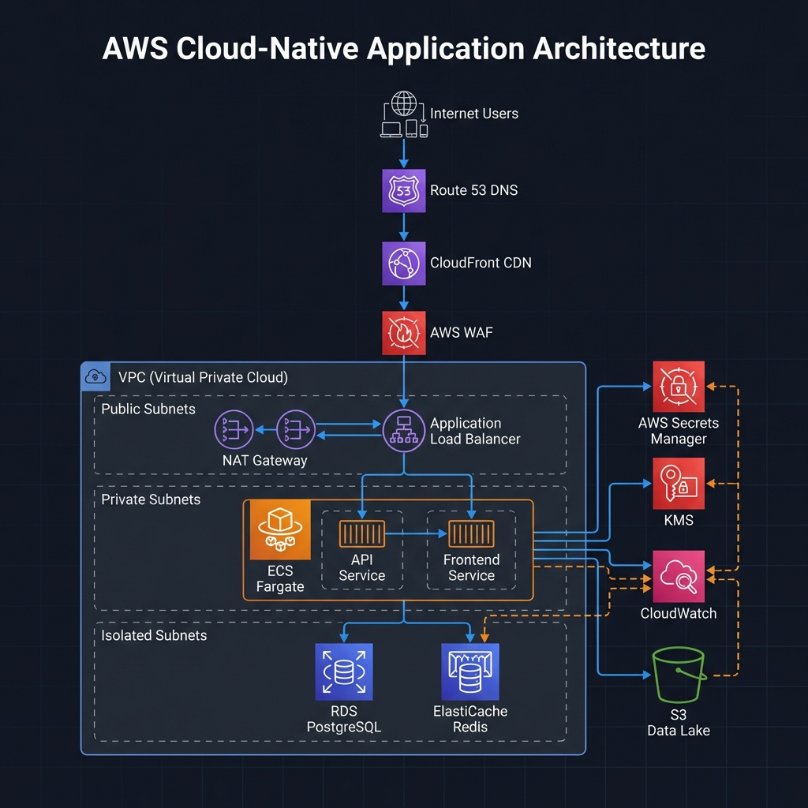

# Toshiro-Shibakita

Cloud-native evolution of [denilsonbonatti/toshiro-shibakita](https://github.com/denilsonbonatti/toshiro-shibakita).

This project takes the original Docker microservices demo and implements a production-ready AWS architecture following the Well-Architected Framework.

## Architecture Overview



```
                           Internet
                              │
                    ┌─────────▼─────────┐
                    │     Route 53      │
                    │   CloudFront CDN  │
                    │      AWS WAF      │
                    └─────────┬─────────┘
                              │
┌─────────────────────────────▼─────────────────────────────┐
│                         VPC                                │
│  ┌──────────────────────────────────────────────────────┐ │
│  │ Public Subnets                                        │ │
│  │   ALB          NAT GW          NAT GW                │ │
│  └──────────────────────────────────────────────────────┘ │
│  ┌──────────────────────────────────────────────────────┐ │
│  │ Private Subnets                                       │ │
│  │   ECS Fargate (API)     ECS Fargate (Frontend)       │ │
│  └──────────────────────────────────────────────────────┘ │
│  ┌──────────────────────────────────────────────────────┐ │
│  │ Isolated Subnets (no internet route)                  │ │
│  │   RDS PostgreSQL         ElastiCache Redis           │ │
│  └──────────────────────────────────────────────────────┘ │
└───────────────────────────────────────────────────────────┘
```

## What Changed from Original

The original project was a PHP app with hardcoded MySQL credentials and nginx load balancer. This evolution:

- Rewrote backend in Node.js/TypeScript with proper error handling
- Migrated from MySQL to PostgreSQL for better cloud support
- Added Redis caching layer
- Moved all credentials to AWS Secrets Manager
- Implemented full IaC with Terraform
- Added CI/CD pipeline with vulnerability scanning
- Containerized for ECS Fargate with ARM64 (Graviton) for cost savings

## Project Structure

```
├── api/                    # Node.js backend
│   ├── src/
│   │   ├── routes/         # API endpoints
│   │   ├── database/       # PostgreSQL and Redis clients
│   │   ├── services/       # Secrets Manager integration
│   │   └── middleware/     # Security (helmet, rate limiting)
│   └── Dockerfile          # Multi-stage build
│
├── frontend/               # Static frontend served by nginx
│
├── infra/                  # Terraform modules
│   ├── modules/
│   │   ├── vpc/            # VPC, subnets, NAT, flow logs
│   │   ├── ecs/            # Fargate cluster, services, auto-scaling
│   │   ├── rds/            # PostgreSQL Multi-AZ
│   │   ├── alb/            # Load balancer, target groups
│   │   ├── waf/            # Web application firewall rules
│   │   ├── elasticache/    # Redis cluster
│   │   ├── secrets/        # Secrets Manager
│   │   └── cloudwatch/     # Logs, metrics, dashboards
│   └── environments/
│       ├── dev/
│       └── prod/
│
├── ci-cd/
│   └── pipeline.yml        # GitHub Actions workflow
│
└── docker-compose.yml      # Local dev environment
```

## Running Locally

```bash
docker-compose up -d
```

This starts PostgreSQL, Redis, the API, and frontend. Access at http://localhost.

## Deploying to AWS

Prerequisites:
- AWS CLI configured
- Terraform 1.6+
- Docker images pushed to ECR

```bash
cd infra/environments/prod
terraform init
terraform plan
terraform apply
```

The terraform will create everything from scratch: VPC, subnets, ECS cluster, RDS, Redis, ALB, WAF, secrets, and all IAM roles.

## Security Decisions

**No hardcoded credentials**: All secrets come from AWS Secrets Manager at runtime. The ECS task role has permission to read the secret, nothing else.

**Network isolation**: Database and cache are in isolated subnets with no route to the internet. They communicate with the app tier through security groups.

**VPC Endpoints**: Services like Secrets Manager, CloudWatch, and ECR are accessed through VPC endpoints, not the public internet.

**WAF**: Rate limiting and AWS managed rule sets for common attacks.

## Observability

CloudWatch handles everything:
- Container logs in JSON format for Logs Insights queries
- ECS Container Insights for CPU/memory metrics
- Custom dashboard with infrastructure and business metrics
- Alarms for high CPU, memory, 5xx errors, and latency

X-Ray tracing is available but optional.

## Cost Estimate

Production (~$280/month):
- ECS Fargate: $36
- RDS Multi-AZ: $120
- ElastiCache: $13
- ALB: $22
- NAT Gateways (2x): $65
- Other: $24

Dev environment uses single NAT and no Multi-AZ, bringing it down to ~$80/month.

## CI/CD Pipeline

The GitHub Actions workflow:
1. Builds Docker images for ARM64
2. Runs Trivy vulnerability scan (fails on HIGH/CRITICAL)
3. Pushes to ECR
4. Deploys to ECS with rolling update
5. Automatic rollback if health checks fail

## Trade-offs

**Why Node.js instead of keeping PHP?**: Better async I/O, native JSON handling, strong AWS SDK, and OpenTelemetry support. PHP would work but requires more boilerplate for the same features.

**Why PostgreSQL over MySQL?**: Performance Insights, better JSON support, pg_stat_statements for query analysis. Both work fine with RDS.

**Why Fargate over EC2?**: No instance management, pay per task, simpler scaling. For high-volume workloads, EC2 with Spot might be cheaper.

**Why ARM64?**: About 40% better price/performance on AWS Graviton. Just need to build the image for the right architecture.

## TODO

- [ ] Add CloudFront distribution
- [ ] Implement secret rotation with Lambda
- [ ] Add Athena queries for S3 data lake
- [ ] Multi-region DR setup

## Credits

Based on [denilsonbonatti/toshiro-shibakita](https://github.com/denilsonbonatti/toshiro-shibakita), a Docker microservices demo by Denilson Bonatti for Digital Innovation One.
