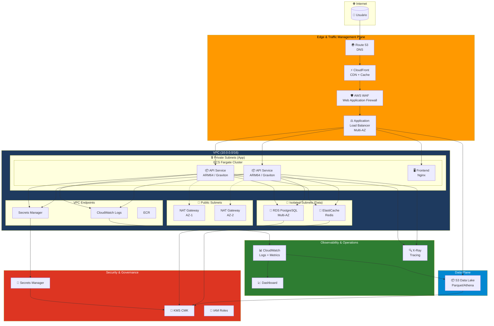
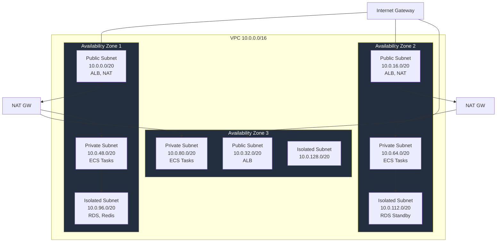
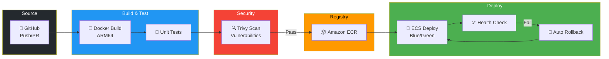
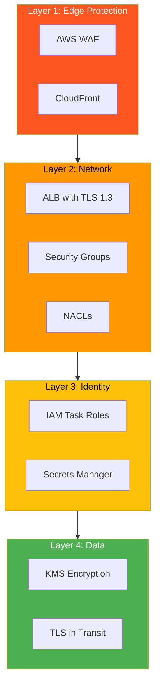

# Toshiro-Shibakita Architecture Diagrams

Este diretório contém os diagramas de arquitetura do projeto.

## Diagrama Principal (Mermaid)

## Network Architecture

## CI/CD Pipeline

## Security Layers

