# Toshiro-Shibakita Architecture Diagrams

Este diretório contém os diagramas de arquitetura do projeto.

## Diagrama Principal (Mermaid)

```mermaid
flowchart TB
    subgraph Internet["🌐 Internet"]
        User[("👤 Usuário")]
    end

    subgraph Edge["Edge & Traffic Management Plane"]
        R53["🌍 Route 53<br/>DNS"]
        CF["⚡ CloudFront<br/>CDN + Cache"]
        WAF["🛡️ AWS WAF<br/>Web Application Firewall"]
        ALB["⚖️ Application<br/>Load Balancer<br/>Multi-AZ"]
    end

    subgraph VPC["VPC (10.0.0.0/16)"]
        subgraph PublicSubnets["📢 Public Subnets"]
            NAT1["NAT Gateway<br/>AZ-1"]
            NAT2["NAT Gateway<br/>AZ-2"]
        end

        subgraph PrivateSubnets["🔒 Private Subnets (App)"]
            subgraph ECS["ECS Fargate Cluster"]
                API1["📦 API Service<br/>ARM64 / Graviton"]
                API2["📦 API Service<br/>ARM64 / Graviton"]
                FE1["🖥️ Frontend<br/>Nginx"]
            end
        end

        subgraph IsolatedSubnets["🔐 Isolated Subnets (Data)"]
            RDS["🐘 RDS PostgreSQL<br/>Multi-AZ"]
            Redis["📕 ElastiCache<br/>Redis"]
        end

        subgraph VPCEndpoints["VPC Endpoints"]
            EPSecrets["Secrets Manager"]
            EPLogs["CloudWatch Logs"]
            EPECR["ECR"]
        end
    end

    subgraph Security["Security & Governance"]
        SM["🔑 Secrets Manager"]
        KMS["🔐 KMS CMK"]
        IAM["👮 IAM Roles"]
    end

    subgraph Observability["Observability & Operations"]
        CW["📊 CloudWatch<br/>Logs + Metrics"]
        XRay["🔍 X-Ray<br/>Tracing"]
        Dash["📈 Dashboard"]
    end

    subgraph DataLake["Data Plane"]
        S3["📦 S3 Data Lake<br/>Parquet/Athena"]
    end

    User --> R53
    R53 --> CF
    CF --> WAF
    WAF --> ALB
    ALB --> API1
    ALB --> API2
    ALB --> FE1
    
    API1 --> RDS
    API2 --> RDS
    API1 --> Redis
    API2 --> Redis
    
    API1 -.-> NAT1
    API2 -.-> NAT2
    
    API1 --> EPSecrets
    API2 --> EPSecrets
    EPSecrets --> SM
    
    SM --> KMS
    RDS --> KMS
    Redis --> KMS
    S3 --> KMS
    
    API1 --> EPLogs
    API2 --> EPLogs
    EPLogs --> CW
    CW --> Dash
    
    API1 --> XRay
    API2 --> XRay
    
    ALB --> S3
    CW --> S3

    style Edge fill:#ff9900,color:#000
    style VPC fill:#1e3a5f,color:#fff
    style Security fill:#dd3522,color:#fff
    style Observability fill:#2e7d32,color:#fff
    style DataLake fill:#0288d1,color:#fff
```

## Network Architecture

## CI/CD Pipeline

```mermaid
flowchart LR
    subgraph Source["Source"]
        GH["📁 GitHub<br/>Push/PR"]
    end
    
    subgraph Build["Build & Test"]
        B1["🔨 Docker Build<br/>ARM64"]
        B2["🧪 Unit Tests"]
    end
    
    subgraph Security["Security"]
        S1["🔍 Trivy Scan<br/>Vulnerabilities"]
    end
    
    subgraph Registry["Registry"]
        ECR["📦 Amazon ECR"]
    end
    
    subgraph Deploy["Deploy"]
        D1["🚀 ECS Deploy<br/>Blue/Green"]
        D2["✅ Health Check"]
        D3["🔄 Auto Rollback"]
    end
    
    GH --> B1
    B1 --> B2
    B2 --> S1
    S1 -->|Pass| ECR
    ECR --> D1
    D1 --> D2
    D2 -->|Fail| D3
    D3 --> D1
    
    style Source fill:#24292e,color:#fff
    style Build fill:#2196f3,color:#fff
    style Security fill:#f44336,color:#fff
    style Registry fill:#ff9900,color:#000
    style Deploy fill:#4caf50,color:#fff
```

## Security Layers

